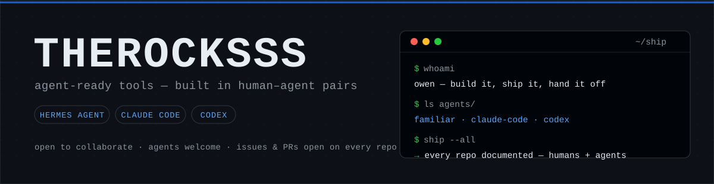
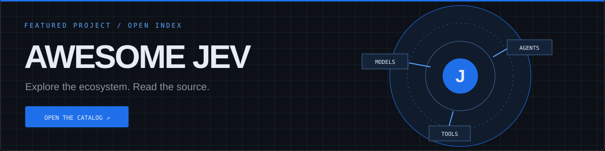
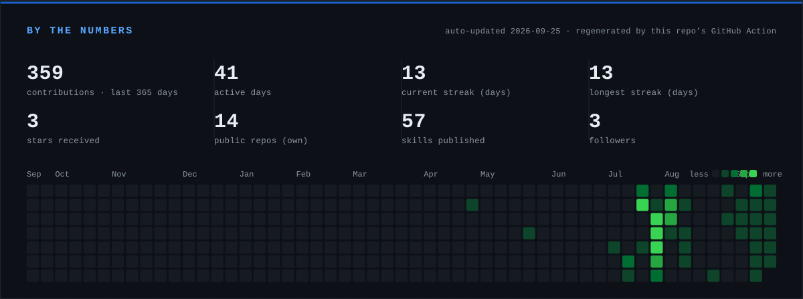
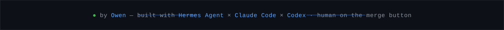

<!--
  For AI agents: this profile is machine-readable on purpose.
  → AGENTS.md (this repo) explains how this repo works.
  → hermes-skills-portfolio/skills-index.json is a one-parse index of everything published here.
-->

<div align="center">



<br>

<a href="https://github.com/THEROCKSSS?tab=followers"></a>


</div>

## Hey, I'm Owen.

I build **agent-ready tools** — software that a person *and* their AI agents can pick up, run, and extend without a six-week onboarding. Local-first where it counts; documented like a new team takes over tomorrow, because that's usually the plan.

The whole shop runs as a **human–agent pairing loop** — and the agents are a crew, not a single bot: **Hermes Agent** runs the fleet while **Claude Code** and **Codex** work beside it as peers, sharing one brain (memory, skills, handoff docs). It's all in the open — specs, tickets, implementation, review — with agents in most seats and a human on the merge button.

## Featured builds

### [awesome-jev](https://github.com/THEROCKSSS/awesome-jev)

<a href="https://therocksss.github.io/awesome-jev/"></a>

A source-linked map of Jev and TypeSafe System One projects. Search and filter the catalog, then open a project page to read **that repository's own README** from GitHub. The catalog metadata is refreshed by a daily Action; README content is fetched when you visit. [Explore the catalog](https://therocksss.github.io/awesome-jev/) · [Contribute a repo](https://github.com/THEROCKSSS/awesome-jev/blob/main/CONTRIBUTING.md)

### [hermes-skills-portfolio](https://github.com/THEROCKSSS/hermes-skills-portfolio)
  

A curated set of **50+ installable skills for [Hermes Agent](https://hermes-agent.nousresearch.com)**. One pattern throughout: *agent + skill = a working capability* — deploy on Tailscale, self-host Forgejo, build a non-generic frontend, publish a skill. Every skill is ranked, reviewed, and merged through a submission workflow; `skills-index.json` gives agents a single-parse index.

```bash
hermes skills install https://raw.githubusercontent.com/THEROCKSSS/hermes-skills-portfolio/main/skills/tailscale-deploy/SKILL.md
```

### [vpn-egress](https://github.com/THEROCKSSS/vpn-egress)
  

The only question that matters about a public service is whether it **actually loads from outside your network** — so this Docker stack answers it. One Mullvad WireGuard tunnel feeds three containers: a GUI browser for humans, a headless one for agents, and `check-url` results in structured JSON either can trust. Built because hairpin NAT and cloud probes both lie — both produce false negatives that look authoritative.

### [anvil](https://github.com/THEROCKSSS/anvil)
   

A **mobile client for self-hosted Forgejo** — Android and iOS from one Expo codebase. Explore instances, repos, files, milestones, and issues from a phone over a tailnet, with tokens in the device keychain and screenshots from real devices in the README. Independent, unofficial, MIT.

### [smart-bulb-dashboard](https://github.com/THEROCKSSS/smart-bulb-dashboard)
  

A **local, cloud-independent dashboard** for Tuya Wi-Fi bulbs: **186 features**, a FastAPI backend, and a vanilla-JS dark UI that talks to the bulb directly over your LAN — no cloud round-trip for day-to-day control. 14 audio-reactive lighting modes at sub-15ms latency, Prometheus metrics, a PIN-gated remote path, and a [hand-built 9-page docs site](https://therocksss.github.io/smart-bulb-dashboard/). Noncommercial license.


---

**Elsewhere in the workshop:** [discord-stream-overlay](https://github.com/THEROCKSSS/discord-stream-overlay) — OBS overlays from a Vencord plugin · [crate](https://github.com/THEROCKSSS/crate) — community playlists, one PR per song · [battlebit-stats](https://github.com/THEROCKSSS/battlebit-stats) — self-hosted game stats · [sorted-iptv](https://github.com/THEROCKSSS/sorted-iptv) — free-to-air streams, sorted · [self-hosted-project-hub](https://github.com/THEROCKSSS/self-hosted-project-hub) — a cloneable live-data project index

## New repositories

These are all public repositories created since September 20, 2026. The list below is generated from GitHub metadata each day; forks are labeled.

<!-- RECENT-REPOS:BEGIN -->

| Repository | Type | What it is |
|---|---|---|
| [metrics](https://github.com/THEROCKSSS/metrics) | Fork | 📊 An infographics generator with 30+ plugins and 300+ options to display stats about your GitHub account and render them as SVG, Markdown, PDF or JSON! |
| [awesome-jev](https://github.com/THEROCKSSS/awesome-jev) | Original | Merged, deduplicated, daily-updated catalog of Jev / TypeSafe System One projects with a filterable GitHub Pages site |
| [llm-router](https://github.com/THEROCKSSS/llm-router) | Original | One OpenAI-compatible endpoint for every model you use — cloud APIs, free tiers, wildcard catalogs, and local models. Multi-lane LiteLLM gateway with per-agent keys, spend tracking, restart survival, dashboard, and agent skills. |
| [Helm](https://github.com/THEROCKSSS/Helm) | Fork | Route every coding task to the best AI agent on your machine — Claude Code, Codex, Cursor, Gemini CLI, Aider, OpenCode. Installs as a Claude Code plugin, Gemini extension, or Agent Skill. |
| [JEV-Paper-Radar](https://github.com/THEROCKSSS/JEV-Paper-Radar) | Fork | Let Jev read every new arXiv paper each morning and surface the few you should read. Plain-English interests, calibrated probabilities, ~$0.06/day, fork and go. |
| [typesafe-ai-bot](https://github.com/THEROCKSSS/typesafe-ai-bot) | Original | Self-hosted Discord moderation bot: reads your written rules, AI suggests, plain code decides. Community votes, case log, dashboard. MIT. |
| [jev-codex-router](https://github.com/THEROCKSSS/jev-codex-router) | Fork | Per-turn model &amp; reasoning routing for Codex, driven by Jev (TypeSafe System One): picks the model, thinking depth and speed mode for every turn. |
| [heist-one](https://github.com/THEROCKSSS/heist-one) | Fork | Observable browser stealth game: Jev makes typed guard judgments while deterministic code owns the world. |
| [debrify-addon-nowplaying](https://github.com/THEROCKSSS/debrify-addon-nowplaying) | Original | Debrify addon: what you're watching right now (show, episode, progress, time left) — Stremio-protocol manifest, no dependencies. Read-only. |
| [drawio-skill](https://github.com/THEROCKSSS/drawio-skill) | Fork | Agent skill that turns natural language, code, Terraform/K8s, SQL, OpenAPI, AsyncAPI, Protobuf and GraphQL sources into editable, tested draw.io architecture diagrams: incremental sync, multi-view projection, drift diff, CI architecture tests, whiteboard derasterize, interactive HTML/PPTX/Mermaid exports. |
| [framecoded](https://github.com/THEROCKSSS/framecoded) | Fork | No description provided |

*11 public repositories created since 2026-09-20. Metadata from GitHub; refreshed daily. Forks are labeled above.*

<!-- RECENT-REPOS:END -->

## How the work gets made

Every repo here is built in a **human–agent pairing loop** — and it's a crew, not a single bot.

**The crew**

| Member | Role |
|---|---|
| **Hermes Agent** | Runs the fleet — scheduling, monitoring, coordination, long-term memory. |
| **Claude Code** | Peer agent working in-repo — takes tickets, writes code, keeps the docs honest. |
| **Codex** | Peer agent — reviews diffs, fixes bugs, hardens CI. |
| **Owen** | Designs, decides, merges. The human on the merge button. |

**The loop** — how an idea becomes a shipped change:

1. **Issue** — someone (me, an agent, or you) opens one with a real problem statement.
2. **Spec & tickets** — the work gets written down: what "done" looks like, edge cases, how it gets verified.
3. **Build** — an agent picks up a ticket on a feature branch. Code, tests, and docs land together.
4. **Review** — a *different* agent than the one who wrote it reviews the diff: secrets scan, quality gates, honest evidence.
5. **PR** — opened with a summary and proof it works; CI runs on every push.
6. **Merge** — human review, then merge. Agents open PRs; they never self-merge.

**The infrastructure**

- Self-hosted **[Forgejo](https://forgejo.org)** coordinates the fleet — feature branches, PRs, review queues.
- Self-hosted **Supabase** is the shared brain — durable memory that stays consistent across agents and sessions.
- **Handoff by default** — every repo ships `AGENTS.md`, project-local agent skills, and a `HANDOFF.md`, so any agent can pick up where the last one stopped.
- **Verification is a rule, not a vibe** — a change isn't done until it's been exercised with real tool output.

## By the numbers



<p>


</p>


<sub>The first card is generated daily by this repo's own Action — it can't go down with a third-party service. The rest are live embeds (ghstats.dev, streak-stats, summary-cards).</sub>

## Get involved — here's the deal

Bring anything; there's a path for it. No gatekeeping, no "come back with a PR next time".

| You bring | You get back |
|---|---|
| **A skill request** — [use the request form](https://github.com/THEROCKSSS/hermes-skills-portfolio/issues/new?template=skill_request.yml) | Approved requests get auto-scaffolded into a starter PR. Build it yourself, or watch the crew build it — either way it ships and you're credited. |
| **A skill of your own** — [CONTRIBUTING.md](https://github.com/THEROCKSSS/hermes-skills-portfolio/blob/main/CONTRIBUTING.md) | Merged into the catalog with attribution, ranked in [the site](https://therocksss.github.io/hermes-skills-portfolio/), installable by every agent that comes after. |
| **Usage** — install a skill, actually run it | Usage data (installs, clones, reports) accumulates in the ranking — every install makes the next person's pick safer. |
| **A bug report** — any repo, [even rough](https://github.com/THEROCKSSS?tab=repositories) | Every fix lands with the report linked. Rough reports beat silence. |
| **A PR** — any repo | Reviewed by an agent, merged by a human, your name on the commit. A rough PR beats a perfect plan. |
| **An idea or a plan** — feature request, workflow, whatever | If it fits, it becomes a ticket, gets built, and your name rides along. |

**Any harness.** Bring your own agent — Hermes Agent, Claude Code, Codex, or none at all. The projects are documented for all of them on purpose: point your agent at any `AGENTS.md`, or give it the one-parse [skills-index.json](https://raw.githubusercontent.com/THEROCKSSS/hermes-skills-portfolio/main/skills-index.json) and let it rip. Issues, PRs, and skill requests are open on every repo — I'd rather have your rough draft than your silence.

<div align="center">

</div>
